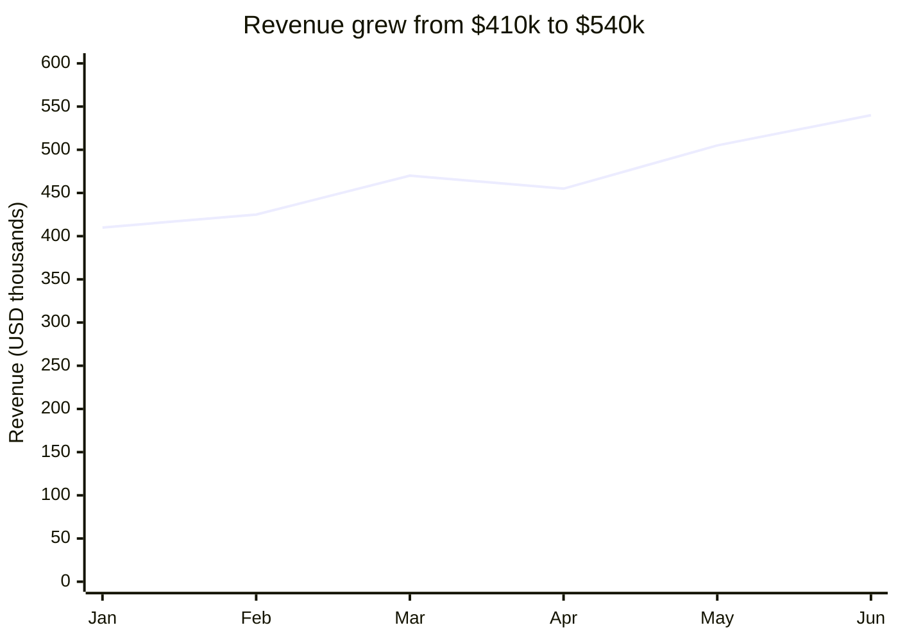
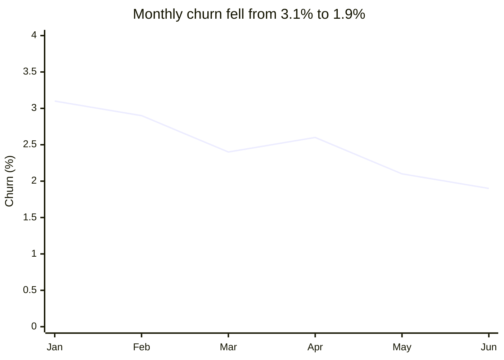
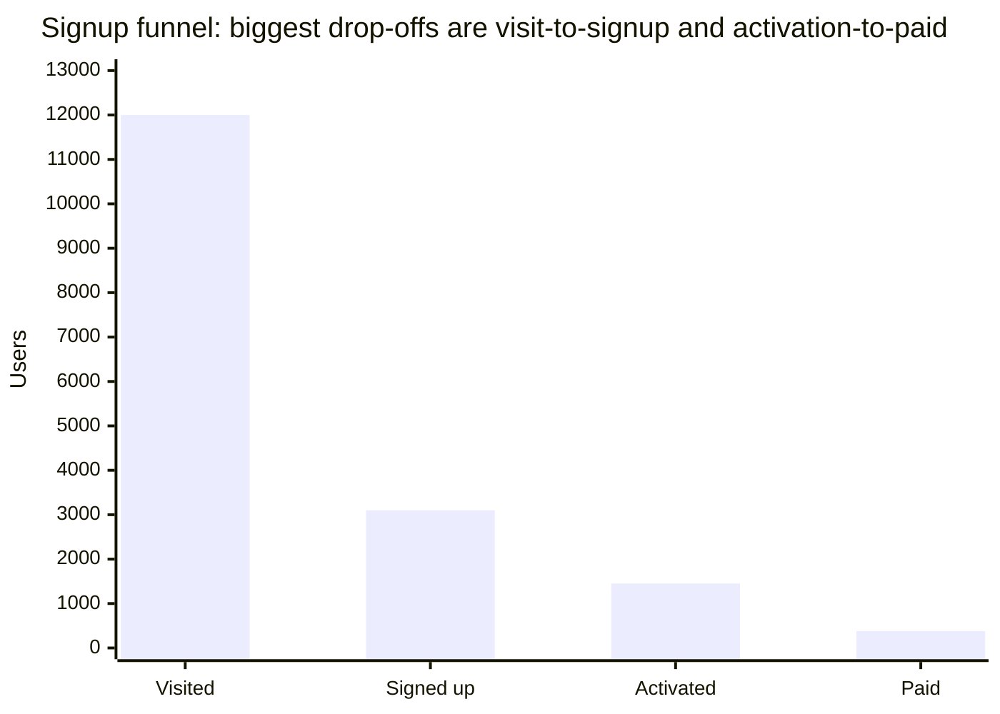
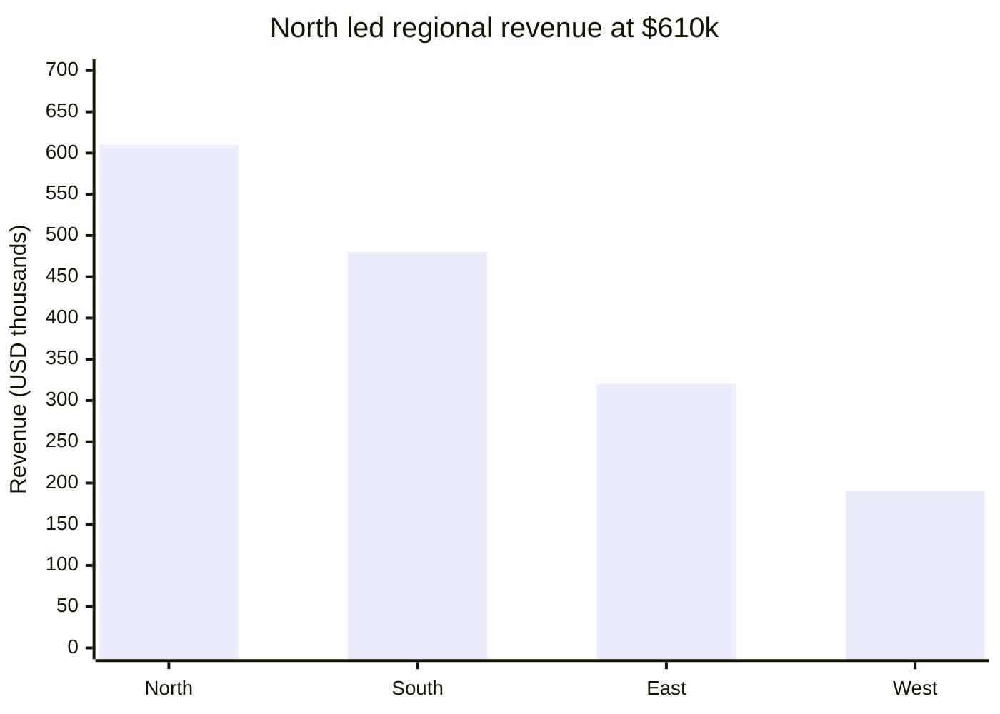

# Q2 2026 summary

Revenue grew from 410k in January to 540k in June, with the strongest month in June (see metrics.csv).
Monthly churn fell from 3.1% to 1.9% over the same period.

The signup funnel still loses most users at activation: of 12,000 visitors, 3,100 signed up, 1,450 activated and 380 paid (funnel.csv).

*Visited 12,000 → Signed up 3,100 (25.8% of visitors) → Activated 1,450 (46.8% of signups) → Paid 380 (26.2% of activated).*

Regional revenue for the quarter was North 610k, South 480k, East 320k, West 190k.

