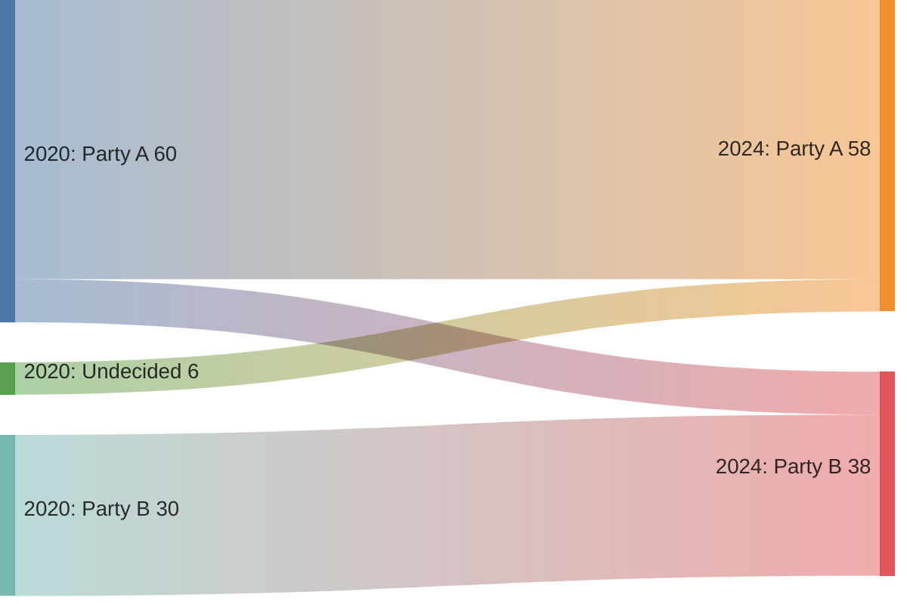

# Alluvial diagram

## When to use

- Several categorical variables in a fixed order, each a column of categories, and cohorts flowing between them: passenger class to sex to survival; party voted in 2020 to party in 2024; job title at hire to title now.
- The same entities observed at several times or stages: the flows are people or units that switched, and the column heights are the marginal totals at each stage.
- Up to about 8 categories per column and 3 to 4 columns; the picture is the crossings, so a few thick ribbons must dominate.
- Excels at: showing where a group came from and went to at the same time (Datawrapper 2025 groups alluvial with Sankey under "flows"; `ggalluvial` made it common in research).

## When not to use

- Quantities that are not the same units all the way through (energy to money): that is a `sankey` of conserved flow, and the node columns are not variables.
- Many categories per column: ribbons braid into noise; collapse to the top 5 plus "other".
- Reading exact transition counts: ribbons are compared poorly; add an `adjacency-matrix` (transition matrix) or a `table`.
- Only two variables and the question is just the shares: a `stacked-bar-100` per column with connecting lines (or a `slope`) is lighter.
- Continuous variables on the axes: that is `parallel-coordinates`.

## Substitutes

- Conserved flows through processes: `sankey`.
- Two categorical variables, exact counts: `adjacency-matrix` heat table or a `mosaic`-style `marimekko`.
- Share per stage without the paths: `stacked-bar-100` per stage.
- Two time points, few categories: `slope`.
- Continuous variables across axes: `parallel-coordinates`.

## Evidence

- Rated `medium`: consistent use in research graphics and newsrooms and native support across tools (Mermaid, Plotly, Datawrapper, Flourish), but ribbons are a width encoding and crossings are compared one at a time (Franconeri et al. 2021); no perception study of alluvial reading.
- Column totals are aligned lengths, read well (Cleveland and McGill 1984); the transitions are the weak part, so label the largest ribbons.
- Sorting within a column (by size, or to minimise crossings) changes readability more than colour; sort deliberately and keep category order consistent across columns when the categories repeat.

## Accessibility

- Label every column category with its count or share; label the largest ribbons where they are widest.
- Colour ribbons by their category in the first column (or the one the text follows) from a colour-blind-safe palette; keep the rest grey when highlighting one path.
- Text alternative: "Alluvial diagram of <n> <units> across <variables>; most of <A> became <B> (<share>); <finding>." Offer the transition table.
- Print the number of units the diagram covers; readers assume the widest ribbon is a majority.

## Build

`cw.py build --chart alluvial --target mermaid --data transitions.csv --x source --y value --series target` writes Mermaid (as a sankey). Other targets are hand-written. Input rows are `from,to,count` per adjacent pair of columns; for three or more columns, prefix category names with the column name (`2020: Labour`) so identical labels in different columns stay distinct nodes.

### mermaid

Same syntax and host support as `sankey`; there is no way to force column alignment or order, so name the stages in the labels and accept the automatic layout.

### plotly

Two forms. `parcats` trace, built for this: `{"type": "parcats", "dimensions": [{"label": "Class", "values": [...]}, {"label": "Survived", "values": [...]}], "counts": [...]}` takes one row per unit or per combination with `counts`; `line.color` colours ribbons by a dimension. Python: `px.parallel_categories(df, dimensions=["class", "sex", "survived"], color="survived_code")`. Or the `sankey` trace with `arrangement: "snap"` when the data is already pairwise flows.

### chartjs

`chartjs-chart-sankey` plugin with `{from, to, flow}` rows, exactly as for `sankey`; column order follows the `priority` option per node. Community plugin, canvas, so add `aria-label` and a fallback table.

### matplotlib

No add-on in the target list draws alluvials directly; `pySankey` (`sankey(left=df.class, right=df.survived, aspect=20)`) draws a two-column alluvial as a matplotlib figure and `alluvial` on PyPI handles more columns with a less maintained API. For an image of a three-plus column diagram, build the Plotly `parcats` figure and export with kaleido. State the package in the script header.

### echarts

`cw.py build --chart alluvial --target echarts --data file.csv --x <x> --y <y> [--series <s>] --html` writes the option and page.

### quickchart

Approximate: QuickChart `sankey` plugin type; write the Chart.js config by hand and URL-encode it (see `kb/targets/quickchart.md`).

## Notes

- 2026-09-17: written from the 2026-09-17 taxonomy research. `vega-lite` is `image`: no parallel-sets layout in Vega-Lite; render with Plotly and link the picture.
