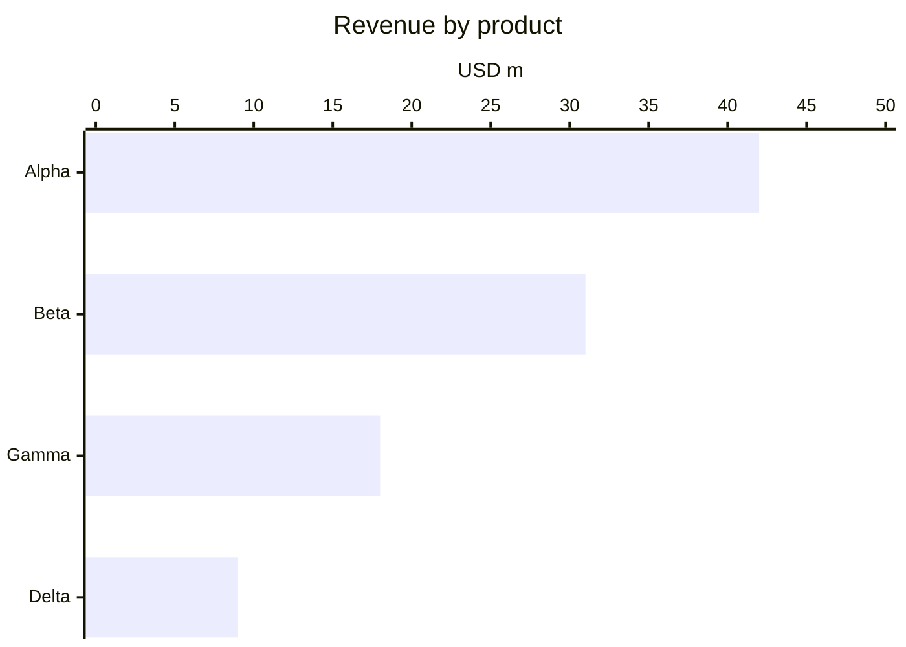

# Bar chart

## When to use

- One quantity per category (revenue by product, population by country) and the question is how they compare in size.
- Ranking: sort by value unless the categories carry their own order (months, size classes, Likert steps); the sorted bar is the default ranking chart.
- Long category labels: run the bars horizontally so labels sit on the left and read naturally; vertical bars (see `column`) suit few short labels or time.
- Up to about 30 categories in an image, 12 in Mermaid; beyond that a ranked subset ("top 15") or a table.
- Excels at: precise comparison of amounts, because length from a shared zero baseline is read almost as accurately as position (Cleveland and McGill 1984).

## When not to use

- Values over continuous time: a `line` shows shape; a bar per period is fine only for a handful of discrete totals (`column`).
- A truncated baseline: bars encode length, so a bar that does not start at zero lies; if the differences are small and matter, use a `dot-plot` that may start elsewhere and says so.
- Two or three measures per category: `grouped-bar` up to 3 series, `dumbbell` for two endpoints, `scatter` for correlation.
- Negative and positive values mixed without a clear zero reference: a `diverging-bar` with the zero line labelled.
- Too many categories with near-equal values: bars become a dense wall; a `lollipop` or `dot-plot` shows the positions with less ink.
- Shares of a whole: readers cannot sum bars visually; use a `stacked-bar-100` or state the total in the title.

## Substitutes

- Few categories in time order: `column`.
- Many categories or values close together: `lollipop` or `dot-plot`.
- Two values per category (before and after, min and max): `dumbbell`.
- Two or three series per category: `grouped-bar`; more series: `small-multiples` of bars or a `heatmap`.
- Values above and below a reference: `diverging-bar`.
- Exact numbers or many measures per row: `table` with inline bars.
- A running total of pluses and minuses: `waterfall`.

## Evidence

- Length on a common zero baseline sits in the top tier of Cleveland and McGill 1984, replicated by Heer and Bostock 2010; bar comparison error is small and stable, hence `high`.
- The Financial Times Visual Vocabulary rule "must always start at 0" follows from the length encoding; a truncated bar exaggerates by the ratio of the visible lengths.
- Sorting makes the intended comparison adjacent, which Franconeri et al. 2021 identify as the layout choice that makes a comparison fast rather than one-pair-at-a-time.
- Practitioner consensus (Datawrapper, Muth 2025; FT) prefers horizontal bars for anything with long labels or more than about 8 categories.

## Accessibility

- Put the value at the end of each bar when there are 15 or fewer; a screen-reader user and a sighted reader then get the same numbers.
- One colour for all bars, a second only to highlight the bar the headline is about; never encode a second variable with colour alone.
- Keep the sort order stable across a series of charts so readers can find a category again.
- Text alternative: "Bar chart of <measure> by <category>, sorted from largest; <top> leads at <value>, <bottom> is lowest at <value>." Offer the table.
- 3:1 contrast between bar fill and background; gap between bars at least a third of the bar width so counts are readable.

## Build

### mermaid



`cw.py build --chart bar --target mermaid --data revenue.csv --x product --y revenue`. Sort the rows before building (Mermaid draws them in the given order). Keep categories under about 12; the axis always starts at 0 when the range is given as `0 --> max`.

### vega-lite

```json
{"$schema": "https://vega.github.io/schema/vega-lite/v6.json", "data": {"url": "revenue.csv"},
 "mark": "bar",
 "encoding": {"y": {"field": "product", "type": "nominal", "sort": "-x"},
              "x": {"field": "revenue", "type": "quantitative"}}}
```

`cw.py build --chart bar --target vega-lite --data revenue.csv --x product --y revenue [--html]` (the builder flips to horizontal when there are more than 6 nominal categories). `"sort": "-x"` orders by value; add a `text` layer with `"x"` and `"y"` bound to the same fields for end labels. Quantitative scales include zero by default for bars; do not set `zero: false`.

### plotly

`{"type": "bar", "orientation": "h", "x": [42, 31, 18, 9], "y": ["Alpha", "Beta", "Gamma", "Delta"], "text": [42, 31, 18, 9], "textposition": "outside"}` with `layout.yaxis.autorange = "reversed"` so the largest sits on top. `cw.py build --chart bar --target plotly ... --html`.

### chartjs

`{"type": "bar", "data": {"labels": [...], "datasets": [{"label": "Revenue", "data": [...]}]}, "options": {"indexAxis": "y", "scales": {"x": {"beginAtZero": true}}}}`. `cw.py build --chart bar --target chartjs ... --html`.

### matplotlib

`ax.barh(categories, values)` on data sorted ascending (so the largest ends on top), `ax.bar_label(ax.containers[0], padding=3)` for end values, `ax.invert_yaxis()` if the sort is descending. `cw.py build --chart bar --target matplotlib --data revenue.csv --x product --y revenue --out chart.py --png chart.png` then `cw.py render --target matplotlib --in chart.py --out chart.png`.

### terminal

`cw.py build --chart bar --target terminal --data sales.csv --x region --y sales` prints horizontal block bars with the value at the end.

### echarts

`cw.py build --chart bar --target echarts --data file.csv --x <x> --y <y> [--series <s>] --html` writes the option and page.

### pptx

`cw.py build --chart bar --target pptx --data file.csv --x <x> --y <y> [--series <s>] --out chart.py --png chart.pptx` then `cw.py render --target pptx --in chart.py --out chart.pptx` (editable native chart).

### quickchart

`cw.py build --chart bar --target quickchart --data file.csv --x <x> --y <y> [--series <s>]` prints a markdown image line whose URL renders the chart (data is public in the URL).

## Notes

- 2026-09-17: written from the 2026-09-17 taxonomy research. `column` is the vertical twin for time-ordered totals; this file covers the horizontal magnitude and ranking bar.
