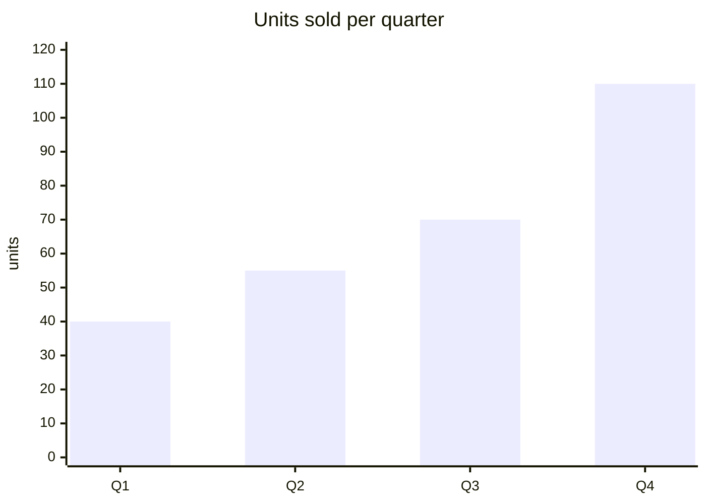

# Column chart

## When to use

- Discrete amounts per period (units sold per quarter, signups per month, rainfall per year) where the message is the size of each period, not the shape of a curve.
- Few periods, roughly 2 to 12, so every column has room for a label and the eye can compare heights.
- Counts that can be zero or negative: a column shows nothing or drops below the baseline honestly, where a line would just wobble.
- A single series with a headline comparison ("Q4 was double Q1"): columns make the ratio visible because length starts at zero.
- Excels at: comparing totals across a handful of periods; the eye reads length from a shared baseline more accurately than any encoding except position (Cleveland and McGill 1984).

## When not to use

- Many periods (dozens of days, hundreds of points): the columns become a picket fence; use `line` or `area`.
- The point is a trend, inflection or crossing: a line carries slope, columns do not.
- More than 3 series side by side: grouped columns force cross-group comparisons that are not adjacent; use `small-multiples` or `line`.
- A truncated y axis: columns must start at zero (Financial Times Visual Vocabulary), otherwise the length lies; if the range is narrow and far from zero, use `dot-plot` or `line`.
- Irregular intervals (a value every 3 days, then every 2 weeks): equal column widths hide the gaps; use a line with markers or a step chart.
- Categories with no order: still a bar, but sorted by value and usually horizontal (`bar`) so labels fit.

## Substitutes

- Many periods or a trend message: `line`.
- Volume of one series over many periods: `area`.
- Unordered categories, long labels: `bar` (horizontal).
- Several parts of a total per period: `stacked-bar` (few periods) or `stacked-area` (many).
- Two or three series per period: `grouped-bar`; more than that: `small-multiples`.
- Above and below a reference: `diverging-bar`.
- Running total across steps: `waterfall`.
- Values that hold between changes: `step`.

## Evidence

- Length from a common zero baseline is read almost as accurately as position (Cleveland and McGill 1984; Heer and Bostock 2010), hence `high`.
- The zero baseline is not optional: the length encoding only works if every column starts at the same place (Franconeri et al. 2021 list axis truncation as a leading source of misleading charts).
- Datawrapper (Muth 2025) recommends columns over lines when periods are few and the reader should compare amounts rather than follow a trend.
- Sorted bars beat unsorted for ranking tasks; for time the order is fixed, so annotate the column the reader should notice.

## Accessibility

- Put the value on or above each column when there are 12 or fewer; readers then never need the axis.
- Keep columns one colour unless colour carries meaning (a highlighted period, positive versus negative); if colour is used, add a label or pattern too.
- Text alternative: "Column chart of <measure> by <period>, <start> to <end>; highest in <period> at <value>, lowest in <period> at <value>." Offer the table on request.
- Contrast 3:1 between column and background; a thin gap between columns so they never merge.

## Build

### mermaid



`cw.py build --chart column --target mermaid --data sales.csv --x quarter --y units`. Keep x categories under about 12 (Mermaid overflows past that). A second `bar [...]` row overlaps rather than groups, so one series per block; for a value label add `showData`-style captions in prose, Mermaid bars have no data labels.

### vega-lite

```json
{"$schema": "https://vega.github.io/schema/vega-lite/v6.json", "data": {"url": "sales.csv"},
 "mark": "bar",
 "encoding": {"x": {"field": "quarter", "type": "ordinal"}, "y": {"field": "units", "type": "quantitative"}}}
```

`cw.py build --chart column --target vega-lite --data sales.csv --x quarter --y units [--html]`. Use `"type": "ordinal"` (or `"temporal"` with `"timeUnit": "yearmonth"`) so columns keep period order; add a `text` layer with `"dy": -6` for value labels. Never set `"scale": {"zero": false}` on y.

### plotly

`{"type": "bar", "x": [...], "y": [...], "text": [...], "textposition": "outside"}`; `layout.bargap = 0.3`. `cw.py build --chart column --target plotly --data sales.csv --x quarter --y units --html`.

### chartjs

`{"type": "bar", "data": {"labels": [...], "datasets": [{"label": "units", "data": [...]}]}}`; `options.scales.y.beginAtZero = true` (the default for bars). `cw.py build --chart column --target chartjs ... --html`.

### matplotlib

`ax.bar(periods, values, width=0.7)` then `ax.bar_label(ax.containers[0])` for value labels; `ax.set_ylim(bottom=0)`. `cw.py build --chart column --target matplotlib --data sales.csv --x quarter --y units --out chart.py --png chart.png` then `cw.py render --target matplotlib --in chart.py --out chart.png`.

### terminal

`cw.py build --chart column --target terminal ...` prints horizontal block bars (there is no vertical text bar worth reading).

### echarts

`cw.py build --chart column --target echarts --data file.csv --x <x> --y <y> [--series <s>] --html` writes the option and page.

### pptx

`cw.py build --chart column --target pptx --data file.csv --x <x> --y <y> [--series <s>] --out chart.py --png chart.pptx` then `cw.py render --target pptx --in chart.py --out chart.pptx` (editable native chart).

### quickchart

`cw.py build --chart column --target quickchart --data file.csv --x <x> --y <y> [--series <s>]` prints a markdown image line whose URL renders the chart (data is public in the URL).

### xlsx

`cw.py build --chart column --target xlsx --data file.csv --x <x> --y <y> [--series <s>] --out chart.py --png chart.xlsx` then `cw.py render --target xlsx --in chart.py --out chart.xlsx` (data sheet plus editable chart).

### plantuml

`cw.py build --chart column --target plantuml --data file.csv --x <x> --y <y> [--series <s>]` writes an `@startchart` block (PlantUML 1.2026.0+); render with `plantuml -tsvg` or the Kroki URL `cw.py render` prints.

### observable-plot

`cw.py build --chart column --target observable-plot --data file.csv --x <x> --y <y> [--series <s>]` emits the `Plot.plot({...})` snippet; add `--html --out page.html` for a page (d3 and Plot 0.6 from jsdelivr).

### gsheets

`cw.py build --chart column --target gsheets --data file.csv --x <x> --y <y> [--series <s>] --out chart.json` writes `values` for `spreadsheets.values.update` at A1 and an `addChart` request for `spreadsheets.batchUpdate` (sheetId 0).

## Notes

- 2026-09-17: written from the 2026-09-17 taxonomy research.
