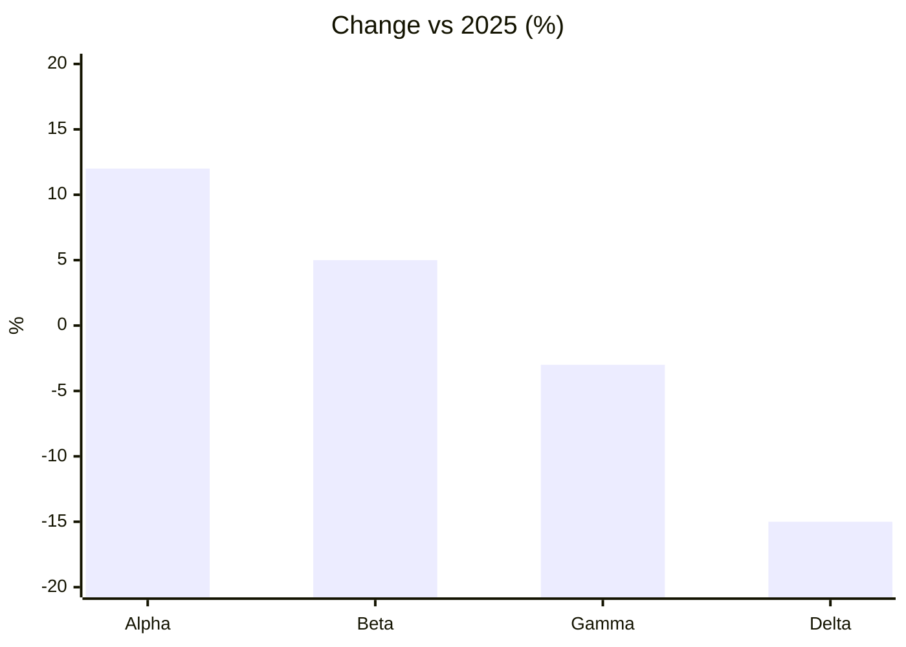

# Diverging bar chart

## When to use

- A signed value per category: change since last year, deviation from the average, surplus or deficit, net promoter score components; bars extend left or right (or down or up) from a labelled reference line.
- The reference is meaningful: zero for change, a target, a mean; the chart is a `bar` whose baseline is that reference.
- Up to about 30 categories, sorted from most positive to most negative so the crossing point is visible at a glance.
- Signed change over time (monthly net flows) as a column variant, where the sign matters more than the level.
- Excels at: separating winners from losers and ranking the size of each deviation, both read as length from a common baseline.

## When not to use

- All values on one side of the reference: an ordinary `bar`.
- Deviation from a non-zero reference presented as absolute values: compute the deviation first; a truncated bar axis is not a diverging bar.
- Two endpoints per category where both matter: `dumbbell`.
- Ordered survey responses (agree to disagree): `diverging-stacked-bar`, which centres the neutral category.
- A running total where each bar builds on the last: `waterfall`.
- Colour as the only sign cue: readers with colour-vision deficiency see identical bars; the direction from the axis is the primary cue, colour and labels reinforce it.

## Substitutes

- Everything positive: `bar`.
- Two values per row: `dumbbell`.
- Likert scales: `diverging-stacked-bar`.
- Cumulative pluses and minuses: `waterfall`.
- Continuous deviation over time (above and below a baseline): `area` with a filled difference, or a `line` with the reference drawn.

## Evidence

- Length from a shared baseline on a common scale is the top tier of Cleveland and McGill 1984 and Heer and Bostock 2010; the diverging form keeps the baseline (now the reference) so `high` holds.
- Franconeri et al. 2021: the intended comparison (above or below) is encoded by direction, a fast global feature; sorting makes the ordering a shape.
- FT Visual Vocabulary files diverging bars under deviation as the default; Datawrapper (Muth 2025) uses it for growth rates and differences from average.
- A two-hue diverging palette with a neutral midpoint is the correct colour treatment (ColorBrewer diverging schemes), and the reference value must be the visual centre.

## Accessibility

- The reference line drawn at 2 px and labelled ("2025 average"); category labels on the axis, never on the bars where they would sit over the wrong side.
- Two hues from a colour-blind-safe diverging pair (Okabe-Ito blue #0072B2 and vermilion #D55E00) plus the sign in the value label; a legend for the two hues.
- Value labels at the bar ends with explicit signs.
- Text alternative: "Diverging bar chart of <measure> relative to <reference>; <n> categories above, <m> below; largest positive <category> (<value>), largest negative <category> (<value>)." Offer the table.
- Horizontal layout for long labels, with labels aligned to the outer edge.

## Build

### mermaid

`approx`: `xychart` draws negative bars below the axis when the y range spans zero, but bar colour cannot change by sign and horizontal layout puts labels on the wrong side of the bars:



Hand-written; sort the values first. For coloured sides render the vega-lite recipe and link the image.

### vega-lite

```json
{"$schema": "https://vega.github.io/schema/vega-lite/v6.json", "data": {"url": "change.csv"},
 "mark": "bar",
 "encoding": {"y": {"field": "product", "type": "nominal", "sort": "-x"},
              "x": {"field": "change", "type": "quantitative", "axis": {"title": "Change vs 2025 (%)"}},
              "color": {"condition": {"test": "datum.change < 0", "value": "#D55E00"}, "value": "#0072B2"}}}
```

Bars extend from zero automatically; a `rule` layer at `"x": {"datum": 0}` emphasises the reference. For a non-zero reference add `{"calculate": "datum.value - 100", "as": "change"}`. Hand-written (the `bar` builder works when colour by sign is not needed); render with `cw.py render --target vega-lite --in chart.vl.json --out chart.svg`.

`cw.py build --chart diverging-bar --target vega-lite --data file.csv --x category --y value` sorts by value and colours the sign.

### plotly

`{"type": "bar", "orientation": "h", "x": changes, "y": products, "marker": {"color": ["#0072B2" if v >= 0 else "#D55E00" for v in changes]}}` with `layout.xaxis.zeroline = true`. Hand-written; open with `cw.py render --target plotly --in fig.json --out chart.html`.

### chartjs

`{"type": "bar", "data": {"labels": products, "datasets": [{"data": changes, "backgroundColor": colours}]}, "options": {"indexAxis": "y"}}`; negative values draw left of zero natively and `backgroundColor` accepts an array per bar. Hand-written.

### matplotlib

`ax.barh(products, changes, color=["#0072B2" if v >= 0 else "#D55E00" for v in changes]); ax.axvline(0, color="black", linewidth=1); ax.bar_label(ax.containers[0], fmt="%+.0f")` on rows sorted by value. Hand-written; run with `cw.py render --target matplotlib --in chart.py --out chart.png`.

## Notes

- 2026-09-17: written from the 2026-09-17 taxonomy research.
