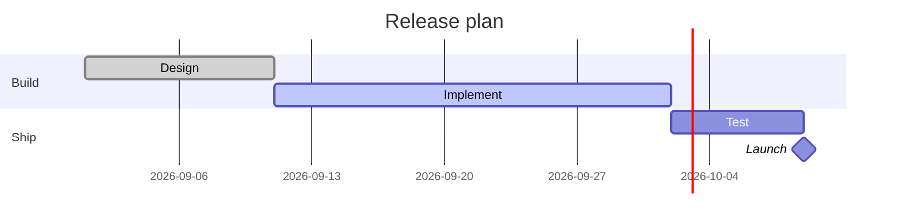

# Gantt chart

## When to use

- A plan or a record of work: tasks with start and end dates, grouped into phases, with milestones and dependencies.
- Up to about 30 tasks on one chart; group into sections or collapse phases beyond that.
- Readers who need to see overlap and the critical path: which tasks run in parallel, which wait on which.
- Status reporting: done, active, late, marked on the bars.
- Excels at: duration and overlap read as bar length and alignment on one time axis; the standard form that every project reader recognises.

## When not to use

- Historical events without a plan structure: a `timeline`.
- Hundreds of tasks: no chart survives; use a table filtered to a phase, or a roll-up Gantt of phases only.
- Effort or cost per task: bar length is time, not work; add a separate `bar` chart.
- Uncertain dates presented as exact bars: draw a range or a lighter extension and say it is an estimate.
- A markdown host older than Mermaid 9: the `gantt` diagram is old and stable, so this rarely matters.

## Substitutes

- Events and eras without dependencies: `timeline`.
- Work completed over time: `line` or `area` of cumulative tasks (a burn-up).
- Resource load per week: `stacked-bar` per week by person.
- Process flow without dates: a flow diagram, not a chart.
- Who is on which task: a `table`.

## Evidence

- Bar length and position on a shared time axis are accurately read (Cleveland and McGill 1984), but the Gantt form is a project management convention (Gantt, 1910s) with no perception study of its own; dependency arrows in particular are known to clutter fast. Rating `low`.
- Practitioner consensus (Data Visualisation Catalogue; Mermaid and Plotly docs) is to group tasks, keep one row per task, and mark today with a vertical line.
- Sort rows by start date within each phase so the chart reads top-left to bottom-right.

## Accessibility

- Label every bar with its task name at the left (the row label) and, when space allows, its dates; colour by status with a pattern or an icon as well as hue.
- A vertical "today" line with a label; milestones as diamonds with text.
- Text alternative: "Gantt chart of <project> from <start> to <end>, N tasks in M phases; <task> is the longest (<duration>); <task> is on the critical path." Provide the task table (name, start, end, depends on).
- Rows at least 20 px tall; interactive targets expose each bar as a focusable element with its dates.

## Build

### mermaid



Hand-written; no builder. Native `gantt`, stable on every host. `after id` expresses dependencies, `crit` marks the critical path, `excludes weekends` skips days, `todayMarker` draws the today line. Keep under about 30 tasks.

### vega-lite

```json
{"$schema": "https://vega.github.io/schema/vega-lite/v6.json", "data": {"url": "tasks.csv"},
 "mark": "bar",
 "encoding": {"y": {"field": "task", "type": "nominal", "sort": {"field": "start"}},
              "x": {"field": "start", "type": "temporal"}, "x2": {"field": "end"},
              "color": {"field": "phase", "type": "nominal"}}}
```

`approx`: a bar with `x` and `x2` gives the bars; dependencies, milestones and the today line are extra `rule` and `point` layers written by hand. Hand-written.

### plotly

Python: `px.timeline(df, x_start="start", x_end="end", y="task", color="phase")` then `fig.update_yaxes(autorange="reversed")`; today line with `fig.add_vline(x=today)`. plotly.js: `type: "bar"`, `orientation: "h"`, `base: start`, `x: duration_ms`. Hand-written.

### chartjs

`approx`: `type: "bar"`, `indexAxis: "y"`, floating bars `data: [[start, end], ...]` on `scales.x.type = "time"` (needs the date adapter); no dependencies. Hand-written.

### matplotlib

`ax.broken_barh([(start, end - start)], (row - 0.4, 0.8), facecolors=colour)` per task with `matplotlib.dates.date2num` values, `ax.set_yticks(rows, names)`, `ax.invert_yaxis()`, `ax.axvline(today, linestyle="--")`; dependencies with `ax.annotate("", xy=..., xytext=..., arrowprops={"arrowstyle": "->"})`. Hand-written, then `cw.py render --target matplotlib --in chart.py --out chart.png`.

## Notes

- 2026-09-17: written from the 2026-09-17 taxonomy research.
