# Grouped bar chart

## When to use

- Each category has two (at most three) values on the same scale, and the comparison that matters is between the bars inside a group: this year against last year, plan against actual, men against women.
- Up to about 10 categories; the chart is really a set of small comparisons laid side by side.
- The reader needs absolute amounts (length from zero), not just the difference; if only the gap matters, see `dumbbell`.
- The series have a natural order (before, after) that the bar order can mirror.
- Excels at: within-group comparison of two adjacent bars, which is fast and accurate (Franconeri et al. 2021).

## When not to use

- More than three series: the eye cannot track which bar is which across groups; facet into `small-multiples` or draw a `dot-plot` with one row per category.
- The comparison is across groups (Alpha's 2025 against Beta's 2025): the matching bars are not adjacent, so the reader hunts; use one series per panel or a `slope` for two periods.
- Many periods per category: this is a time series; use a `line` per category.
- Parts of a total: bars beside each other do not sum visually; use a `stacked-bar`.
- A truncated baseline: grouped bars are still bars and must start at zero.
- Very different magnitudes between series (units against revenue): separate charts, never a dual axis.

## Substitutes

- Two endpoints per category, gap is the message: `dumbbell`.
- Two periods, many categories, rank change matters: `slope`.
- More than three series: `small-multiples` of `bar`, or a `heatmap` when pattern beats value.
- Parts of a whole per category: `stacked-bar` or `stacked-bar-100`.
- One measure, many categories: plain `bar`.
- Three or more values per category read as a profile: `dot-plot` with a marker per series on one row.

## Evidence

- Bars in a group share a zero baseline, so within-group comparison uses length on a common scale, the top tier of Cleveland and McGill 1984 and Heer and Bostock 2010; hence `high` for the within-group task.
- The cross-group task is much weaker: Franconeri et al. 2021 show comparisons between non-adjacent marks are slow and error-prone, which is why the FT Visual Vocabulary calls grouped bars "tricky with more than 2" series and Datawrapper (Muth 2025) caps them at 3.
- From Data to Viz's caveat page recommends ordering groups by one series so the second series can be read as a deviation from an ordered baseline.

## Accessibility

- Two series must differ by colour and by something else: a lighter tint plus a pattern, or direct labels on the first group.
- A legend is required for 2 or more series; place it in the order the bars appear.
- Values on bars when there are 20 or fewer bars in total.
- Text alternative: "Grouped bar chart of <measure> by <category> for <series A> and <series B>; <series B> is higher in <n> of <total> categories, most in <category>." Offer the table with one column per series.
- Colours from a colour-blind-safe pair (Okabe-Ito blue #0072B2 and orange #E69F00) at 3:1 against the background.

## Build

### mermaid

`approx`: Mermaid's `xychart` draws several `bar` series overlapping at the same x (issue #5292), not side by side, so smaller values are hidden behind larger ones.

```mermaid
xychart-beta
    title "Units by region"
    x-axis [North, South, East]
    y-axis "Units" 0 --> 100
    bar "2025" [80, 55, 60]
    bar "2026" [70, 65, 90]
```



`cw.py build --chart grouped-bar --target mermaid ...` emits this and warns. Readable only when one series is always smaller; otherwise render an image with the vega-lite target and link it.

### vega-lite

```json
{"$schema": "https://vega.github.io/schema/vega-lite/v6.json", "data": {"url": "units.csv"},
 "mark": "bar",
 "encoding": {"x": {"field": "region", "type": "nominal"},
              "xOffset": {"field": "year", "type": "nominal"},
              "y": {"field": "units", "type": "quantitative"},
              "color": {"field": "year", "type": "nominal"}}}
```

`cw.py build --chart grouped-bar --target vega-lite --data units.csv --x region --y units --series year [--html]`. `xOffset` does the grouping (Vega-Lite 5+); for horizontal groups swap to `y` nominal, `yOffset`, `x` quantitative. Long data (one row per category and series) is required; pivot wide data with the `fold` transform.

### plotly

One `{"type": "bar", "name": "2025", "x": regions, "y": values}` trace per series and `layout.barmode = "group"`. `cw.py build --chart grouped-bar --target plotly ... --series year --html`.

### chartjs

`{"type": "bar", "data": {"labels": regions, "datasets": [{"label": "2025", "data": [...]}, {"label": "2026", "data": [...]}]}}`: several datasets on an unstacked bar chart group by default. `cw.py build --chart grouped-bar --target chartjs ... --series year --html`.

### matplotlib

`w = 0.8 / n_series; ax.bar(x + i*w - 0.4 + w/2, values_i, width=w, label=name)` for series `i` over `x = numpy.arange(n_categories)`, then `ax.set_xticks(x, categories)` and `ax.legend()`. `cw.py build --chart grouped-bar --target matplotlib --data units.csv --x region --y units --series year --out chart.py --png chart.png` then `cw.py render --target matplotlib --in chart.py --out chart.png`.

### echarts

`cw.py build --chart grouped-bar --target echarts --data file.csv --x <x> --y <y> [--series <s>] --html` writes the option and page.

### pptx

`cw.py build --chart grouped-bar --target pptx --data file.csv --x <x> --y <y> [--series <s>] --out chart.py --png chart.pptx` then `cw.py render --target pptx --in chart.py --out chart.pptx` (editable native chart).

### quickchart

`cw.py build --chart grouped-bar --target quickchart --data file.csv --x <x> --y <y> [--series <s>]` prints a markdown image line whose URL renders the chart (data is public in the URL).

### xlsx

`cw.py build --chart grouped-bar --target xlsx --data file.csv --x <x> --y <y> [--series <s>] --out chart.py --png chart.xlsx` then `cw.py render --target xlsx --in chart.py --out chart.xlsx` (data sheet plus editable chart).

## Notes

- 2026-09-17: written from the 2026-09-17 taxonomy research.
