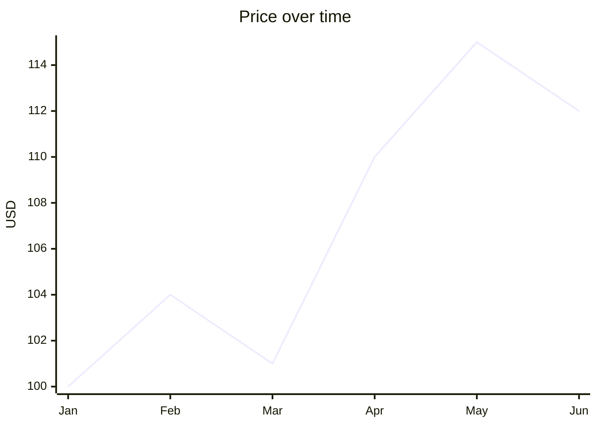

# Line chart

## When to use

- A continuous measure sampled over ordered time (or another ordered axis): prices, temperatures, traffic, rates.
- The point is the shape of change: trend, seasonality, inflection, crossing of two series.
- Up to about five series that the reader must compare at the same moments; for more, grey them and highlight one, or use small multiples.
- Many points (hundreds or thousands): a line stays legible where bars turn into a wall.
- Excels at: showing slope and shape at a glance; the eye reads slope and crossing points quickly (Franconeri et al. 2021).

## When not to use

- Categories with no order (products, countries): a line implies continuity that does not exist; use a bar or dot plot.
- Very few periods (2 to 4) and the message is the totals, not the shape: a column chart or a slope chart.
- Discrete counts per period where the total matters (units sold per quarter): columns say "amount" better than a line.
- More than about five series with similar values: the spaghetti hides everything; facet.
- Two measures on different scales on one chart (dual axis): the crossing point is an artefact of axis choice; use two panels or index both to 100.
- Irregular sampling with big gaps: connect-the-dots invents values; show points, or a step chart when the value holds until the next change.

## Substitutes

- Few periods, discrete totals: `column` (bar over time).
- Two periods, many entities: `slope`.
- Rank changes over time: `bump`.
- Many series: `small-multiples` of lines; or `heatmap` with time on x and series on y.
- Value holds between changes (prices, status): `step`.
- Volume plus trend for one series: `area`; several stacked parts of a total over time: `stacked-area` (only when the total matters).
- Distribution over time: `ridgeline` or box plots per period; uncertainty: `range-band` (fan chart).
- Daily values over years: `calendar-heatmap`.

## Evidence

- Position on a common scale is the most accurately read encoding (Cleveland and McGill 1984; Heer and Bostock 2010): a line is position over time, hence `high`.
- Slope and shape are read as fast global features, while comparing two distant points is slow (Franconeri et al. 2021), so annotate the specific comparison the reader must make.
- Aspect ratio: bank typical slopes to about 45 degrees (Cleveland 1993); a very wide chart flattens real change.
- The y axis need not start at zero for a line, but say so when it does not; a truncated axis exaggerates change.

## Accessibility

- Direct-label series at their right ends instead of a legend when 5 or fewer; a legend is still present for 2 or more series (identity must not be colour-alone).
- Distinguish series by colour and by line style or marker when more than three, for colour-blind readers and greyscale print.
- Provide a text alternative: "Line chart of <measure> from <start> to <end>; it rose from A to B, with a dip in <period>." Offer the table on request.
- Contrast: 3:1 for the line against the background; 2 px minimum stroke.

## Build

### mermaid



`cw.py build --chart line --target mermaid --data prices.csv --x date --y price`. Several series are several `line [...]` rows; name them (`line "2026" [...]`) for a legend on Mermaid 11.16+, otherwise state the order in a caption. x values are category labels, so dates render as given: pre-format them (`2026-01` or `Jan`).

### vega-lite

```json
{"$schema": "https://vega.github.io/schema/vega-lite/v6.json", "data": {"url": "prices.csv"},
 "mark": {"type": "line", "point": true},
 "encoding": {"x": {"field": "date", "type": "temporal"}, "y": {"field": "price", "type": "quantitative"},
              "color": {"field": "series", "type": "nominal"}}}
```

`cw.py build --chart line --target vega-lite --data prices.csv --x date --y price [--series col] [--html]`. Use `"type": "temporal"` for dates so the axis formats them; drop `point` above about 40 points; `"y": {"scale": {"zero": false}}` when the range is far from zero. End labels: add a `text` layer filtered to the last date.

### plotly

`{"type": "scatter", "mode": "lines+markers", "name": "2026", "x": [...], "y": [...]}` per series; `layout.hovermode = "x unified"` gives one tooltip per date. `cw.py build --chart line --target plotly ... --html`.

### chartjs

`{"type": "line", "data": {"labels": [...], "datasets": [{"label": "2026", "data": [...]}]}}`; for real time axes add `chartjs-adapter-date-fns` and `scales.x.type = "time"`. `cw.py build --chart line --target chartjs ... --html`.

### matplotlib

`ax.plot(dates, values, marker="o", linewidth=2, label=name)` per series, `ax.legend()` or end labels via `ax.annotate`, dates through `matplotlib.dates.DateFormatter`. `cw.py build --chart line --target matplotlib --data prices.csv --x date --y price --out chart.py --png chart.png` then `cw.py render --target matplotlib --in chart.py --out chart.png`.

### terminal

`cw.py build --chart line --target terminal --data prices.csv --x date --y price` prints a block sparkline with endpoints and range; one line per series with `--series`.

## Notes

- 2026-09-17: written from the 2026-09-17 taxonomy research; the canonical example for the knowledge base format.
- 2026-09-18: prefer end labels over a legend when there are three series or fewer
