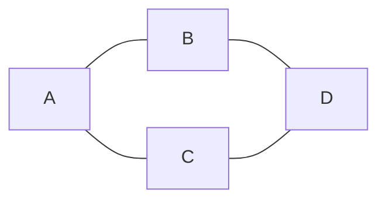

# Network diagram

## When to use

- Entities and their pairwise connections where the structure is the message: clusters, hubs, bridges, isolates. Social ties, package dependencies, co-authorship, character interactions.
- Sparse graphs of up to about 200 nodes (fewer for print), with a layout (force-directed or manual) that puts connected nodes near each other and lets communities show as blobs.
- Following paths: node-link layouts beat matrices at "is there a route from A to B through C" (Ghoniem, Fekete and Castagliola 2004).
- Node size for a degree or value and colour for a community or type, when both are explained.
- Excels at: giving a gestalt of structure that no table conveys; the eye finds clusters and hubs as global features (Franconeri et al. 2021).

## When not to use

- Dense graphs (edge density above roughly 0.1) or more than a few hundred nodes: the hairball; use `adjacency-matrix`, filter to a subgraph, or aggregate nodes.
- Reading values: force layouts imply positions that mean nothing, and edge lengths are artefacts; never let readers compare distances.
- Ordered nodes (time, sequence): `arc-diagram` keeps the order.
- A hierarchy with a few cross links: `tree` or `edge-bundling`.
- Weighted, directed flows among a small set: `chord` or `sankey`.
- Reproducibility matters: force layouts differ between runs; fix the seed and save node positions with the chart.

## Substitutes

- Dense or large: `adjacency-matrix`.
- Ordered nodes: `arc-diagram`.
- Hierarchy plus links: `edge-bundling`; pure hierarchy: `tree` or `dendrogram`.
- Small weighted symmetric set: `chord`; directional conserved flows: `sankey`.
- Only the counts of connections: `bar` of degree per node.

## Evidence

- Ghoniem, Fekete and Castagliola 2004 (Information Visualization 4(2)): node-link diagrams beat adjacency matrices on path-following tasks for small sparse graphs (about 20 nodes), while matrices win on most other tasks as size and density grow. One controlled study plus wide practice, hence `medium`.
- Layout is not data: positions from a force simulation carry no scale (Data to Viz caveat); label the encodings actually used (size, colour) and say the layout is automatic.
- Franconeri et al. 2021: clusters are seen fast; explicit community colouring or a hull around each cluster makes the intended grouping the easy one.

## Accessibility

- Label hubs and the nodes the text names; for more than about 50 nodes label only the top-degree nodes and give a searchable table.
- Node colour for at most 8 communities (Okabe-Ito) with a legend; edges in grey at 30 to 50 percent opacity; node outline for contrast.
- Text alternative: "Network of <n> <nodes> and <m> <links>; <k> clusters; the most connected node is <A> (<degree>); <finding>." Offer the edge list and a degree table.
- Interactive versions: keyboard focus on nodes with name and degree read out; avoid hover-only information.

## Build

Not supported by `cw.py build`; hand-written. Input is an edge list (`source,target[,weight]`) and optionally a node table (`id,group,size`). Compute the layout once (networkx spring layout with a seed) and save the positions; then any target can draw the same picture.

### mermaid

`flowchart` (`graph`) draws nodes and edges with an automatic layered layout (ELK default in 12, dagre before): structure only, no force layout, no node size, no weights beyond edge labels (`A -- 3 --- B`), so `approx`. Fine for up to about 30 nodes in markdown on GitHub, GitLab and Obsidian; beyond that, an image.

### vega-lite

Vega-Lite has no force layout. Either drop to full Vega (the `force-directed-layout` example: `force` transform with `collide`, `nbody`, `link` forces; render with vl-convert's `vega_to_svg`), or precompute positions with networkx and draw two Vega-Lite layers: `rule` for edges (`x`, `y`, `x2`, `y2` from a joined edge table) and `circle` plus `text` for nodes, axes hidden. Render with `cw.py render --target vega-lite --in net.vl.json --out net.png`.

### plotly

Precompute positions, then one `scatter` trace with `mode: "lines"` holding all edges as `x`/`y` arrays separated by `null`, and one `scatter` trace with `mode: "markers+text"` for nodes (`marker.size` from degree, `marker.color` from group), axes hidden. The plotly.py network example does exactly this with networkx.

### matplotlib

`G = nx.from_pandas_edgelist(df, "source", "target", edge_attr="weight"); pos = nx.spring_layout(G, seed=7, k=0.3); nx.draw_networkx_edges(G, pos, alpha=0.3, ax=ax); nx.draw_networkx_nodes(G, pos, node_size=[20 * G.degree(n) for n in G], node_color=groups, cmap="tab10", ax=ax); nx.draw_networkx_labels(G, pos, font_size=8, ax=ax); ax.set_axis_off()`. Community colours via `nx.community.louvain_communities(G, seed=7)`. Render with `cw.py render --target matplotlib --in net.py --out net.png`.

### echarts

Hand-written: series type `graph` with `layout: "force"`. See `kb/targets/echarts.md`.

## Notes

- 2026-09-17: written from the 2026-09-17 taxonomy research. When a request has more than about 100 nodes, ask whether a filtered subgraph or an `adjacency-matrix` answers the question before drawing the hairball.
