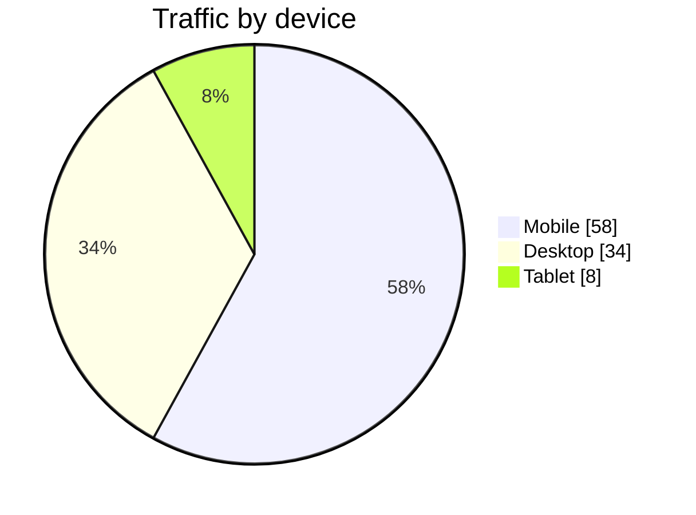

# Pie chart

## When to use

- One whole split into at most five parts with clearly different sizes: budget by department, votes by party, traffic by device.
- The question is "is A plus B a majority?" or "roughly what fraction is A?": a pie answers sum-of-slices questions better than bars (Skau and Kosara 2016).
- A general audience that reads a pie as "the whole" without explanation; the shape itself says part-to-whole.
- The numbers are percentages that sum to 100 and the exact values are printed on or beside the slices.
- Excels at: a single rough share, a quarter or a half seen instantly against the circle.

## When not to use

- More than five slices, or several slices of similar size: readers cannot rank them; use a sorted `bar`.
- Comparing across several pies (regions, years): slice-to-slice comparison between circles is slow and inaccurate; use `stacked-bar-100` or `small-multiples` of bars.
- Change over time: pies per period hide the trend; use `stacked-area` or a `line` of shares.
- Values that do not sum to one whole (overlapping categories, survey multi-select): the shape lies.
- 3D, exploded or tilted pies: the distortion destroys the arc encoding readers rely on (Skau and Kosara 2016). Refuse.
- A legend-by-colour with unlabelled slices: readers hunt; label directly or use bars.

## Substitutes

- Ranking or precise comparison of parts: `bar` sorted by value; `lollipop` for many parts.
- Several wholes: `stacked-bar-100`.
- Whole-number percentages for a general audience: `waffle`.
- Headline number in the middle: `donut`.
- Nested categories: `treemap` or `sunburst`.
- Parts over time: `stacked-area`.

## Evidence

- Readers of pies use arc length and area, not the central angle; donuts read as accurately as pies, and exploded or angle-only variants read worst (Skau and Kosara 2016). Kosara's practical rule: up to five slices, one whole, big differences, direct labels.
- Angle and area rank below position and length in accuracy (Cleveland and McGill 1984; Heer and Bostock 2010), so a bar beats a pie for "which is bigger"; the pie's advantage is limited to sum-of-slices judgments against the whole.
- `medium`: one focused study plus long practitioner consensus (FT, Datawrapper, From Data to Viz caveat pages), not a replicated body of work.

## Accessibility

- Label every slice with its name and percent directly; keep the legend only as a backup and never as the sole identifier.
- Start the largest slice at 12 o'clock and go clockwise in descending order, "Other" last.
- Five colour-blind-safe hues at most; adjacent slices must differ in lightness as well as hue, with a thin white separator.
- Text alternative: "Pie chart of <measure> by <category>: <A> <p>%, <B> <p>%, <C> <p>%; A and B together are <p>%." Offer the table.

## Build

### mermaid



`cw.py build --chart pie --target mermaid --data traffic.csv --x device --y visits`. Slices draw in input order, so sort the data descending first; `showData` prints values; colours come from the theme only.

### vega-lite

```json
{"$schema": "https://vega.github.io/schema/vega-lite/v6.json", "data": {"url": "traffic.csv"},
 "mark": "arc",
 "encoding": {"theta": {"field": "visits", "type": "quantitative"},
              "color": {"field": "device", "type": "nominal", "sort": "-theta"}}}
```

`cw.py build --chart pie --target vega-lite --data traffic.csv --x device --y visits [--html]`. Direct labels: layer a `text` mark with `"radius": 90` and the same `theta` encoding; `"view": {"stroke": null}` removes the frame.

### plotly

`{"type": "pie", "labels": [...], "values": [...], "sort": false, "textinfo": "label+percent", "direction": "clockwise"}`. `cw.py build --chart pie --target plotly --data traffic.csv --x device --y visits --html`.

### chartjs

`{"type": "pie", "data": {"labels": [...], "datasets": [{"data": [...]}]}}`; percentages on slices need the `chartjs-plugin-datalabels` plugin, otherwise the legend carries the names. `cw.py build --chart pie --target chartjs ... --html`.

### matplotlib

`ax.pie(values, labels=names, autopct="%1.0f%%", startangle=90, counterclock=False); ax.axis("equal")`. `cw.py build --chart pie --target matplotlib --data traffic.csv --x device --y visits --out chart.py --png chart.png` then `cw.py render --target matplotlib --in chart.py --out chart.png`.

### echarts

`cw.py build --chart pie --target echarts --data file.csv --x <x> --y <y> [--series <s>] --html` writes the option and page.

### pptx

`cw.py build --chart pie --target pptx --data file.csv --x <x> --y <y> [--series <s>] --out chart.py --png chart.pptx` then `cw.py render --target pptx --in chart.py --out chart.pptx` (editable native chart).

### quickchart

`cw.py build --chart pie --target quickchart --data file.csv --x <x> --y <y> [--series <s>]` prints a markdown image line whose URL renders the chart (data is public in the URL).

### xlsx

`cw.py build --chart pie --target xlsx --data file.csv --x <x> --y <y> [--series <s>] --out chart.py --png chart.xlsx` then `cw.py render --target xlsx --in chart.py --out chart.xlsx` (data sheet plus editable chart).

### gsheets

`cw.py build --chart pie --target gsheets --data file.csv --x <x> --y <y> [--series <s>] --out chart.json` writes `values` for `spreadsheets.values.update` at A1 and an `addChart` request for `spreadsheets.batchUpdate` (sheetId 0).

## Notes

- 2026-09-17: written from the 2026-09-17 taxonomy research.
- 2026-09-18: two-slice pies are fine when the question is whether one part is a majority; don't downgrade to a single stat or bar just because there are only two slices.
- 2026-09-18: label slices directly, never with a legend; readers should never have to hunt between a slice and a colour key.
- 2026-09-18: Sort slices largest first, starting at 12 o'clock.
