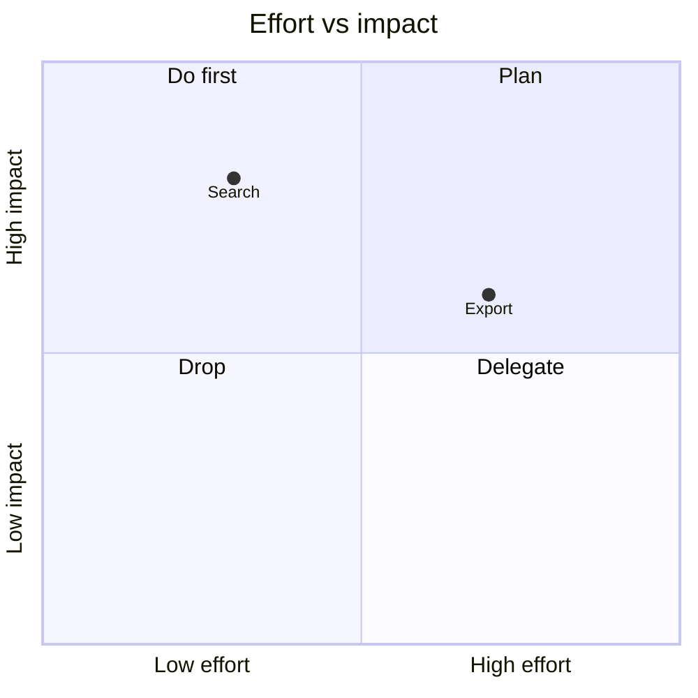

# Quadrant chart

## When to use

- A handful of named items scored on two criteria where the four corners have business meaning (do first, plan, delegate, drop; stars, cash cows, question marks, dogs).
- Workshop and planning documents in markdown, where Mermaid draws it natively and the labels are the point.
- Excels at: turning two scores into a decision category the reader can act on.

## When not to use

- The scores are real measurements and the relationship matters: the quadrant lines impose false thresholds; use a `scatter` and let the reader see the distribution.
- More than about 25 items: labels collide; use a `scatter` with hover or a ranked `table`.
- The thresholds are arbitrary and undisclosed: a point just across a line is treated as a different class. Say how the midlines were set.
- Misuse: presenting analyst opinion scores as if measured (the "magic quadrant" problem).

## Substitutes

- Measured data: `scatter` (add reference lines for thresholds).
- A third measure: `bubble`.
- Ranking on one criterion: `bar` or `dot-plot`.
- Many items: `table` sorted by a combined score.

## Evidence

- It is a scatter with reference lines, so position reads accurately (Cleveland and McGill 1984); the evidence is `low` for the quadrant framing itself, which adds categorisation that the data may not support (the threshold problem noted above). No perception study addresses the 2x2 specifically.
- Practitioner guides (Datawrapper, DVC) treat it as an annotated scatter, which is the safe interpretation.

## Accessibility

- Label every point directly; colour by quadrant is decoration, not encoding, so keep it to two tints and rely on the labels.
- The quadrant names are text on the chart, so a screen reader alternative is a four-item list of which items fall in each.
- Keep at least 3:1 contrast for point markers against the tinted backgrounds.

## Build

### mermaid

Points are normalised to 0..1 on both axes. `cw.py build --chart quadrant --target mermaid --data items.csv --x effort --y impact --series name` emits the points (pre-scale the columns to 0..1); add the axis and quadrant labels by hand.

### vega-lite

Approximate: a `point` chart with `text` labels plus two `rule` layers at the thresholds (`{"mark": "rule", "encoding": {"x": {"datum": 50}}}`), and optional `rect` layers for the tints. Start from `cw.py build --chart scatter --target vega-lite ...` and add the layers.

### plotly

Approximate: `scatter` trace with `mode: "markers+text"`, `layout.shapes` for the two lines and four tinted rectangles, `layout.annotations` for quadrant names. Hand-written.

### chartjs

Approximate: `scatter` dataset with the `chartjs-plugin-annotation` plugin for the lines and boxes; labels need `chartjs-plugin-datalabels`. Hand-written.

### matplotlib

Approximate: `ax.scatter`, `ax.axvline` and `ax.axhline` at the thresholds, `ax.axhspan`/`ax.axvspan` for tints, `ax.annotate` per point. Hand-written.

### echarts

Hand-written: `scatter` with `markLine` at the thresholds and `markArea` tints. See `kb/targets/echarts.md`.

### observable-plot

`Plot.dot` plus `Plot.ruleX([mx])` and `Plot.ruleY([my])` at the medians with `Plot.text` labels.

## Notes

- 2026-09-18: written from the 2026-09-17 taxonomy research.
