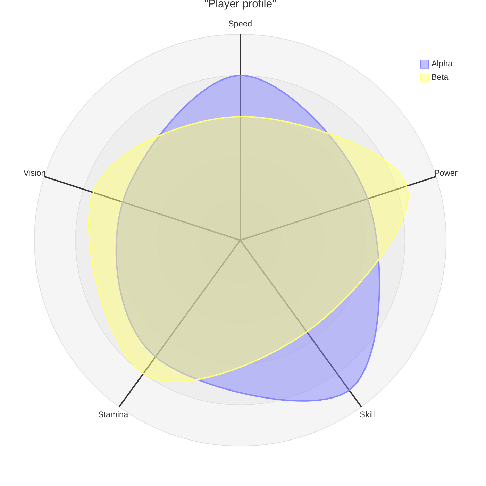

# Radar chart

## When to use

- One to three entities scored on 5 to 10 variables that share a scale (0 to 100, 1 to 5 ratings), where the shape of the profile is the point: a "spiky" versus a "round" candidate, product, or player.
- Audiences who know the form (sports analytics, game stats, skills assessments) and read the outline as a gestalt, not the numbers.
- The variables have a sensible order around the circle (FT: "make sure variables are organised sensibly"), for example grouped by theme, so adjacent axes relate.
- Excels at: a memorable silhouette for a single entity's profile; recognition rather than measurement.

## When not to use

- More than three entities: overlapping polygons hide each other; use `parallel-coordinates`, a `heatmap`, or `small-multiples` of bars.
- Variables in different units or scales: normalising hides real magnitudes and the polygon becomes arbitrary.
- The reader must compare values precisely: angular position and radial length are read worse than aligned bars (Cleveland and McGill 1984); a sorted `bar` per entity is more accurate.
- The enclosed area is being read as a total score: the area depends on the axis order and squares with the values, so it is meaningless.
- Few variables (under 5): a bar or dot plot; more than about 10: the polygon is a blob.

## Substitutes

- Precise comparison across variables: `bar` per entity or a `dot-plot` with one row per variable and a marker per entity.
- Many entities: `parallel-coordinates` (same data, straight axes) or a `heatmap` of entity by variable.
- Two entities, difference per variable: `dumbbell`.
- Profile of one entity against a target: `bullet` per variable.

## Evidence

- `low`: radial length and angle rank below aligned position and length in Cleveland and McGill 1984, and the polygon's area is an artefact of axis order. No study shows a radar beating a bar for any comparison task; the rating rests on practitioner caveats (From Data to Viz caveat page; FT "use only when variables are organised sensibly"; the 2026-09-17 taxonomy research lists it as discouraged for many-entity comparison).
- The chart persists because the silhouette is memorable (Bateman et al. 2010 on embellishment aiding recall), which is a reason to allow it for profiles, not for measurement.
- Grid rings help: readers compare each vertex to the ring, converting a length task into a position task on a non-aligned scale.

## Accessibility

- Ring labels at every gridline (20, 40, 60...), axis labels at every spoke, and the values in a table beside the chart; polygons are hard to read for anyone and impossible for screen readers.
- Fill polygons at low opacity (about 20 percent) with a 2 px outline; distinguish entities by colour and by line style (solid, dashed).
- Legend for 2 or more entities.
- Text alternative: "Radar chart of <entity> across <n> attributes; strongest in <attribute> (<value>), weakest in <attribute> (<value>)." Offer the table.
- Keep the same axis order across all radar charts in a document.

## Build

### mermaid

`cw.py build --chart radar --target mermaid --data players.csv --x attribute --y score --series player`. Needs Mermaid 11.6 or later; on the 11.13 host floor it renders on GitHub, GitLab and Obsidian. `max` fixes the outer ring.

### vega-lite

`approx`: Vega-Lite has no polar axes. Compute `x = r * cos(theta)` and `y = r * sin(theta)` with a `calculate` transform per variable index (`theta = 2 * PI * index / n`), draw the polygon with a `line` mark (`"order"` by index, closed by repeating the first row), and add spokes as `rule` marks. Hand-written and long; render with `cw.py render --target vega-lite --in chart.vl.json --out chart.svg`, or use the matplotlib recipe for an image.

### plotly

`{"type": "scatterpolar", "r": [80, 65, 90, 70, 60, 80], "theta": ["Speed", "Power", "Skill", "Stamina", "Vision", "Speed"], "fill": "toself", "name": "Alpha"}` per entity (repeat the first point to close), `layout.polar.radialaxis = {"range": [0, 100]}`. Hand-written; open with `cw.py render --target plotly --in fig.json --out chart.html`.

### chartjs

`{"type": "radar", "data": {"labels": attributes, "datasets": [{"label": "Alpha", "data": [80, 65, 90, 70, 60], "fill": true}]}, "options": {"scales": {"r": {"min": 0, "max": 100}}}}`. `cw.py build --chart radar --target chartjs --data players.csv --x attribute --y score --series player --html`.

### matplotlib

`ax = fig.add_subplot(polar=True); angles = numpy.linspace(0, 2*numpy.pi, n, endpoint=False); ax.plot(numpy.append(angles, angles[0]), numpy.append(values, values[0])); ax.fill(..., alpha=0.2); ax.set_xticks(angles, labels); ax.set_ylim(0, 100)`. Hand-written; run with `cw.py render --target matplotlib --in chart.py --out chart.png`.

### echarts

`cw.py build --chart radar --target echarts --data file.csv --x <x> --y <y> [--series <s>] --html` writes the option and page.

### pptx

`cw.py build --chart radar --target pptx --data file.csv --x <x> --y <y> [--series <s>] --out chart.py --png chart.pptx` then `cw.py render --target pptx --in chart.py --out chart.pptx` (editable native chart).

### quickchart

`cw.py build --chart radar --target quickchart --data file.csv --x <x> --y <y> [--series <s>]` prints a markdown image line whose URL renders the chart (data is public in the URL).

### xlsx

`cw.py build --chart radar --target xlsx --data file.csv --x <x> --y <y> [--series <s>] --out chart.py --png chart.xlsx` then `cw.py render --target xlsx --in chart.py --out chart.xlsx` (data sheet plus editable chart).

## Notes

- 2026-09-17: written from the 2026-09-17 taxonomy research. Allowed for profiles of one to three entities; the selection rules steer many-entity comparisons to parallel coordinates or heatmaps.
