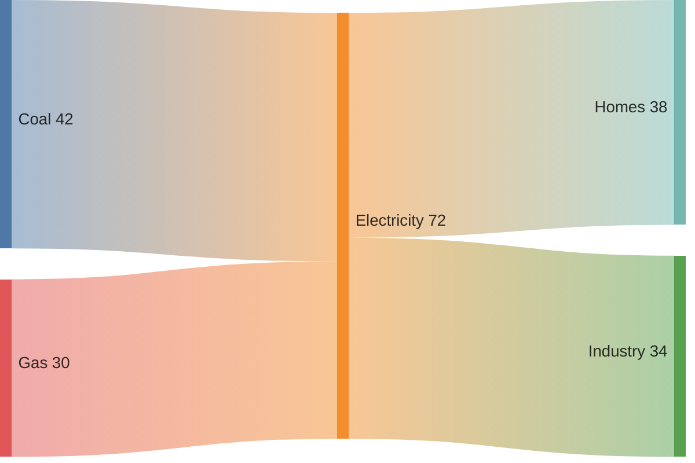

# Sankey diagram

## When to use

- Conserved quantities moving through stages: energy from sources through conversion to end use, a budget from revenue lines to spending, users from landing page to purchase, migrants from origin regions to destinations.
- The message is both the big flows and the split: "half of source A goes to B, the rest scatters".
- Two to five stages, up to about 20 nodes per stage, and a handful of flows that dominate; thin flows can be grouped into "other".
- Directional: left to right (or top to bottom) means before and after, or from and to.
- Excels at: showing allocation and loss along a path in one picture; node heights add up, so totals are visible without a second chart (FT Visual Vocabulary; Datawrapper 2025 lists Sankey under "flows").

## When not to use

- Cycles or feedback loops: a Sankey is acyclic; use a `network` or `chord`.
- Many-to-many flows among equals with no direction (trade between ten countries): `chord` or `adjacency-matrix`.
- Reading precise numbers: link widths are compared poorly; label the widths or add a `table`.
- More than about 20 nodes per stage or hundreds of links: a wall of hair; aggregate.
- Quantities that are not conserved across stages (node totals differ in and out) unless the loss is shown explicitly as an exit flow; otherwise readers assume conservation.
- A simple two-stage split of one total: a `stacked-bar` or `treemap` is clearer.

## Substitutes

- Categorical variables across ordered stages (class to survival, party to vote): `alluvial`.
- Symmetric pairwise flows: `chord`; dense pairs with values: `adjacency-matrix`.
- Drop-off through fixed stages with one path: `funnel`.
- One split of one whole: `stacked-bar` or `treemap`; running total of gains and losses: `waterfall`.
- Flows on a map: `flow-map`.

## Evidence

- Rated `medium`: strong practitioner consensus (FT, Datawrapper, Data to Viz) and support in every major tool since 2023, but no perception study of Sankey reading accuracy. Link width is a length encoding read at an angle, which Cleveland and McGill 1984 rank below aligned position; node height (aligned, a length) is read better, so put the numbers that matter in node labels.
- Data to Viz caveat: readers follow one path at a time (Franconeri et al. 2021 on slow pairwise comparison); highlight the path the text discusses and grey the rest.
- Node order and stage alignment change the picture; sort nodes by size within a stage unless a natural order exists, and say so.

## Accessibility

- Label every node with name and value; label the five largest links; grey minor links.
- Colour by source node (or by category) from a colour-blind-safe palette; links inherit the source colour at 40 to 60 percent opacity. Never colour-only: names are on the nodes.
- Text alternative: "Sankey diagram of <quantity> from <stage 1> to <stage n>; the largest flow is <A> to <B> (<value>, <share>); <finding>." Offer the source-target-value table.
- Interactive versions (Plotly) need hover text with value and share; static versions need the numbers printed.

## Build

`cw.py build --chart sankey --target mermaid --data flows.csv --x source --y value --series target` writes Mermaid; other targets are hand-written from the recipes. Input is always rows of `source,target,value` with no cycles.

### mermaid

Raw CSV lines, no indentation, quote labels that contain commas. Renders on GitHub, GitLab, Obsidian (11.13 floor). No control over node order or colours beyond theme; still marked experimental by Mermaid, stable in practice since 10.3.

### plotly

`{"type": "sankey", "node": {"label": ["Coal", "Gas", "Electricity", "Homes"]}, "link": {"source": [0, 1, 2], "target": [2, 2, 3], "value": [42, 30, 38]}}`; `arrangement: "snap"` keeps stage columns aligned, `node.color` and `link.color` for the palette, `valueformat` and `valuesuffix` for labels. Python: `go.Figure(go.Sankey(node=dict(label=...), link=dict(source=..., target=..., value=...)))`. Best interactive choice; hover shows values.

### chartjs

`chartjs-chart-sankey` plugin: `type: "sankey"`, `data: {datasets: [{data: [{from: "Coal", to: "Electricity", flow: 42}, ...], colorFrom: ..., colorTo: ...}]}`. Community plugin, so check it against the Chart.js 4 version in use; canvas output needs `aria-label` and a fallback table.

### matplotlib

`matplotlib.sankey.Sankey` draws single-node inflow and outflow diagrams (`Sankey(ax=ax, flows=[42, 30, -38, -34], labels=[...], orientations=[0, 0, 0, 0]).finish()`), not multi-stage graphs; for a real multi-stage Sankey as an image, build the Plotly figure and export with kaleido, or use the `pySankey` package (`sankey(left, right, leftWeight=...)`) for two stages. Say which in the script header.

## Notes

- 2026-09-17: written from the 2026-09-17 taxonomy research. `vega-lite` is `image` because Vega-Lite has no sankey layout; full Vega needs a hand-built layout, so render with Plotly or Mermaid and link the picture.
