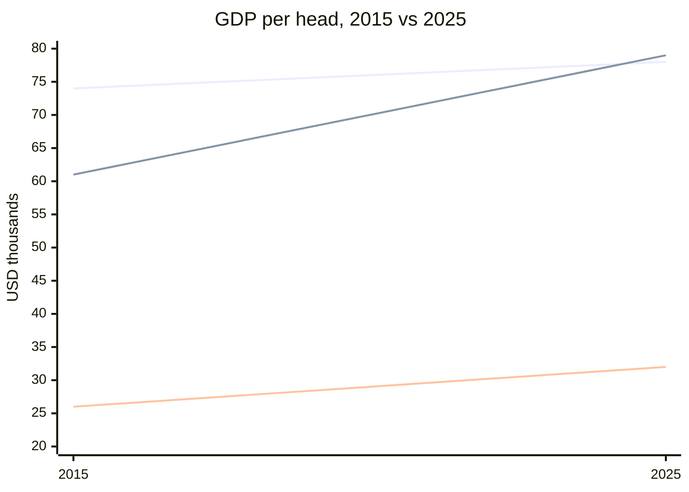

# Slope chart

## When to use

- Exactly two (at most three) time points and several entities: countries in 2015 and 2025, teams before and after a rule change, products last year and this year.
- The message is direction and magnitude of change per entity, and which entities crossed each other.
- Up to about 15 entities, each labelled at both ends, so the chart doubles as a sorted table.
- Rank changes between two seasons or elections when the values themselves also matter (a `bump` shows only rank).
- Excels at: showing who went up, who went down, and by how much, with every entity named.

## When not to use

- More than three periods: the chart is a `line` chart; use it or `bump`.
- Many entities with similar values: labels collide and lines merge; show the top and bottom movers, grey the rest, or use `dumbbell`.
- Two measures with different units on the two sides: a slope implies one scale.
- The two points are not comparable (different samples, definitions changed): say so or do not draw it.

## Substitutes

- Gap between two values per entity, horizontal layout with more room for labels: `dumbbell`.
- Many periods and ranks: `bump`; many periods and values: `line`.
- One entity, two values: `column` with two bars.
- Change as a signed amount: `diverging-bar` sorted by change.
- Before and after with a direction arrow (newsroom style): `dumbbell` with arrowheads.

## Evidence

- Both ends are position on a common scale and the connector is a direction judgment, the two most accurately read encodings in Cleveland and McGill 1984 (replicated by Heer and Bostock 2010), hence `high`.
- Franconeri et al. 2021: the layout makes the intended comparison (each entity's change) the adjacent, easy one, while cross-entity comparison at one date stays available on the shared axis.
- Storytelling with Data recommends it for two-period comparisons with direct labels; Datawrapper (Muth 2025) groups it with "developments over time" for few points.
- The y axis may omit zero because readers read endpoints and slopes, but state the range.

## Accessibility

- Label every line at both ends with name and value; no legend.
- Colour by direction (up, down, flat) with three colour-blind-safe hues plus a solid versus dashed distinction, or highlight only the entities in the story and grey the rest.
- Text alternative: "Slope chart comparing <measure> in <year A> and <year B> for N entities; largest rise <entity> (A to B), largest fall <entity>."
- Minimum 2 px lines; keep at least 12 px between labels or thin the set.

## Build

### mermaid



`approx`: one `line` per entity with two x categories. Named series give a legend on Mermaid 11.16+ only, there are no end labels, and beyond 5 or 6 entities colours run out. Hand-written; no builder.

### vega-lite

```json
{"$schema": "https://vega.github.io/schema/vega-lite/v6.json", "data": {"url": "gdp.csv"},
 "layer": [
  {"mark": "line", "encoding": {"x": {"field": "year", "type": "ordinal"}, "y": {"field": "value", "type": "quantitative"}, "detail": {"field": "country"}}},
  {"mark": {"type": "text", "align": "left", "dx": 4}, "transform": [{"filter": "datum.year == 2025"}],
   "encoding": {"x": {"field": "year", "type": "ordinal"}, "y": {"field": "value", "type": "quantitative"}, "text": {"field": "country"}}}]}
```

Hand-written from the gallery example (`line_slope`); `"detail"` draws one line per entity without a colour legend, the text layer labels the right end. Set `"width": 200` so the slopes are steep enough to read.

`cw.py build --chart slope --target vega-lite --data file.csv --x period --y value --series entity` draws one line per entity between the two periods with the entity name at the right end.

### plotly

One `{"type": "scatter", "mode": "lines+markers+text", "x": ["2015", "2025"], "y": [a, b], "text": ["", "Norway"], "textposition": "middle right"}` per entity; `layout.showlegend = false`. Hand-written; `approx` because the end labels are per-trace text rather than a mark.

### chartjs

`type: "line"` with `labels: ["2015", "2025"]` and one dataset per entity; hide the legend and add end labels with the `chartjs-plugin-datalabels` plugin or a caption. `approx`: no built-in end labels.

### matplotlib

For each entity `ax.plot([0, 1], [a, b], marker="o")` then `ax.text(-0.05, a, f"{name} {a}", ha="right", va="center")` and `ax.text(1.05, b, f"{name} {b}", ha="left", va="center")`; `ax.set_xticks([0, 1], ["2015", "2025"])`, hide spines. Hand-written, then `cw.py render --target matplotlib --in chart.py --out chart.png`.

### echarts

Hand-written: `line` series per entity over a two-category axis with `endLabel`. See `kb/targets/echarts.md`.

### pptx

Approximate: LINE_MARKERS with two categories and a series per entity.

### observable-plot

`cw.py build --chart slope --target observable-plot --data file.csv --x <x> --y <y> [--series <s>]` emits the `Plot.plot({...})` snippet; add `--html --out page.html` for a page (d3 and Plot 0.6 from jsdelivr).

## Notes

- 2026-09-17: written from the 2026-09-17 taxonomy research.
