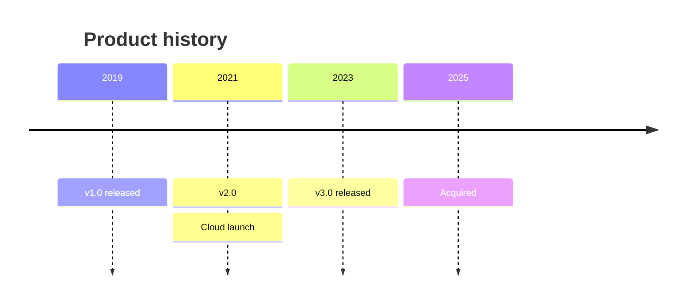

# Timeline

## When to use

- Dated events with no measure (releases, decisions, incidents, reigns, eras): the order and spacing are the content.
- Periods with a start and an end for a few entities (Priestley style bars: the lives of composers, the tenure of leaders, the support windows of product versions).
- A narrative that readers need to anchor in time before the data charts: the timeline sets the scene.
- Roughly 5 to 30 events or periods; fewer is a list, more is a table.
- Excels at: order and duration read directly from position and length on a time axis.

## When not to use

- Any quantity per period: that is a `line`, `column` or `step` chart, not a timeline.
- Tasks with dependencies, owners and progress: `gantt`.
- Hundreds of events: aggregate to counts per period (`column`) or a `calendar-heatmap`.
- Events with imprecise dates ("around 1850") drawn as exact points: use a range bar and say the precision.
- A time axis with a break to squeeze in far-apart eras: the spacing is the point; split into panels instead.

## Substitutes

- Scheduled work with dependencies: `gantt`.
- Counts of events over time: `column` or `calendar-heatmap`.
- Start and end of one measure for many entities: `dumbbell` with a time axis.
- A value that holds between events: `step`.
- Narrative order without real dates: a list or a flow diagram, not a chart.

## Evidence

- Position along a time axis for events and length for durations are the accurately read encodings of Cleveland and McGill 1984, but there is no study of timeline reading as such and the form is a diagram convention (Priestley 1765; Data Visualisation Catalogue). Rating `low`, which is fine: the chart makes no quantitative claim beyond dates.
- Franconeri et al. 2021 on annotation applies directly: every event needs its label next to it, and the reader's comparison (which came first, which lasted longer) should be adjacent.
- Keep the axis linear; a non-linear or broken time axis destroys the only encoding.

## Accessibility

- Every event labelled with its date and name; alternate label sides above and below the axis to avoid overlap, or stack rows.
- Period bars distinguished by lightness or pattern, not hue alone; group colour only when groups exist.
- Text alternative: "Timeline of <topic> from <start> to <end> with N events: <first event> (<date>), ..., <last event> (<date>)." The event list in order is the complete alternative; provide it.
- Interactive targets: keyboard focus through events in date order.

## Build

### mermaid



Hand-written; no builder. Native `timeline` diagram, stable on every 11.x host; `section Name` groups periods. The spacing is by entry, not proportional to time, so the caption should say so when gaps vary. For proportional duration bars use `gantt` instead.

### vega-lite

```json
{"$schema": "https://vega.github.io/schema/vega-lite/v6.json", "data": {"url": "eras.csv"},
 "mark": "bar",
 "encoding": {"y": {"field": "name", "type": "nominal", "sort": {"field": "start"}},
              "x": {"field": "start", "type": "temporal"}, "x2": {"field": "end"}}}
```

`approx`: durations are bars with `x` and `x2`; point events are a `point` or `tick` layer with a `text` layer for labels, and there is no dedicated timeline layout. Hand-written.

### plotly

Python: `px.timeline(df, x_start="start", x_end="end", y="name")` then `fig.update_yaxes(autorange="reversed")`; point events as a `scatter` trace with `mode: "markers+text"` on the same figure. Native through the express helper. Hand-written.

### chartjs

`approx`: `type: "bar"`, `indexAxis: "y"`, floating bars `data: [[start, end], ...]` on a `scales.x.type = "time"` axis (needs the date adapter); point events as a `scatter` dataset. Hand-written.

### matplotlib

Durations: `ax.barh(names, [e - s for s, e in spans], left=[s for s, e in spans], height=0.5)`; events: `ax.plot(dates, [0] * len(dates), "o")` on a horizontal axis line with `ax.annotate(label, (d, 0), xytext=(0, 12 * level), textcoords="offset points", ha="center")` alternating levels. Hand-written, then `cw.py render --target matplotlib --in chart.py --out chart.png`.

### echarts

Hand-written: `scatter` on a `time` axis with labels. See `kb/targets/echarts.md`.

### plantuml

`@startgantt` with zero-length milestones (`[Launch] happens at 2026-03-01`), or a `@startuml` timing diagram.

### observable-plot

`Plot.barX(data, {y: "event", x1: "start", x2: "end"})` or `Plot.dot` on a time x for point events.

## Notes

- 2026-09-17: written from the 2026-09-17 taxonomy research.
