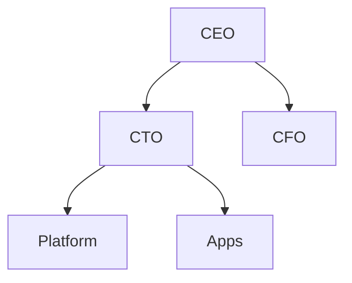

# Tree diagram

## When to use

- A hierarchy where the structure is the message and there is no size to encode: org charts, taxonomies, decision trees, folder outlines, family trees.
- Up to about a hundred leaves with collapsing, or a few dozen without; every node keeps a readable label.
- The path from root to any leaf must be traceable: node-link trees make paths explicit where a treemap only nests.
- Documentation and markdown: Mermaid draws trees natively, so the structure lives in the text next to its explanation.
- Excels at: showing levels, siblings and paths with labels on every node.

## When not to use

- Nodes carry a size that matters: use `treemap`, `icicle` or `sunburst`.
- Hundreds of leaves in a static image: the layout becomes a wall of tiny text; collapse levels, show a subtree, or use an indented `table`.
- Graphs that are not trees (a node with two parents, cycles): a tree layout hides the extra links; use a `network`.
- Merge distances or similarity levels (clustering): a `dendrogram` encodes the height; a plain tree does not.
- Sequential process with counts: a `sankey` or `funnel`.

## Substitutes

- Sizes: `treemap`, `icicle`, `sunburst`; aesthetics with rough sizes: `circle-packing`.
- Clustering with heights: `dendrogram`.
- Non-tree structure: `network`; dense relations: `adjacency-matrix`.
- Many leaves, exact lookup: indented `table` or an outline list.
- Hierarchy plus cross-links: `edge-bundling`.

## Evidence

- Trees encode structure, not quantity, so the perceptual encoding studies do not apply; the case is convention, and it is universal (org charts, taxonomies, Mermaid's flowchart and mindmap). `low` by the rating's definition, with no known contradicting evidence.
- Franconeri et al. 2021: readers trace paths one at a time; keep depth shallow, siblings ordered by a stated rule (alphabetical, size, seniority) and labels horizontal.
- Popularity `common`: every diagram tool and D3, Vega, ECharts and Observable Plot draw trees; charting libraries such as Chart.js do not.

## Accessibility

- Every node is text; keep labels short and horizontal, and order siblings by a rule stated in the caption.
- Links with 3:1 contrast; colour by level or branch is optional and never the only cue.
- Text alternative: an indented outline of the tree ("<root>: <A> (<children>), <B> ...") is a complete substitute and should be offered by default.
- In Mermaid, the diagram is text in the source, which is a good fallback for screen readers only if the outline is also present.

## Build

### mermaid

Hand-written; `flowchart TD` (top-down) or `LR` for wide trees, `mindmap` for a radial tree with indentation syntax (`root((Company))` then indented children). Both are stable in Mermaid 11.x and render on GitHub, GitLab and Obsidian.

### vega-lite

Full Vega: `stratify` then `tree` transform (`"type": "tree", "method": "tidy", "size": [{"signal": "height"}, {"signal": "width - 100"}]`), `treelinks` and `linkpath` for the edges, `symbol` and `text` marks for nodes, rendered by vl-convert. Hand-written from the Vega tree-layout example. `approx`.

### plotly

Hand-written: compute node positions (Reingold-Tilford via `networkx` plus `graphviz_layout(prog="dot")`, or `igraph`'s tree layout), then one `scatter` trace of `mode: "lines"` for edges and one of `mode: "markers+text"` for nodes with axes hidden. `approx`, layout done elsewhere.

### chartjs

Not available: no hierarchical layout. Use Mermaid in markdown or an image.

### matplotlib

Hand-written: `networkx` graph, `pos = nx.nx_agraph.graphviz_layout(G, prog="dot")` (needs Graphviz) or `nx.bfs_layout(G, root)` for a plain layered layout, `nx.draw(G, pos, with_labels=True, node_color="#EEE", edgecolors="#333")`. Render with `cw.py render --target matplotlib --in chart.py --out chart.png`.

## Notes

- 2026-09-17: written from the 2026-09-17 taxonomy research.
