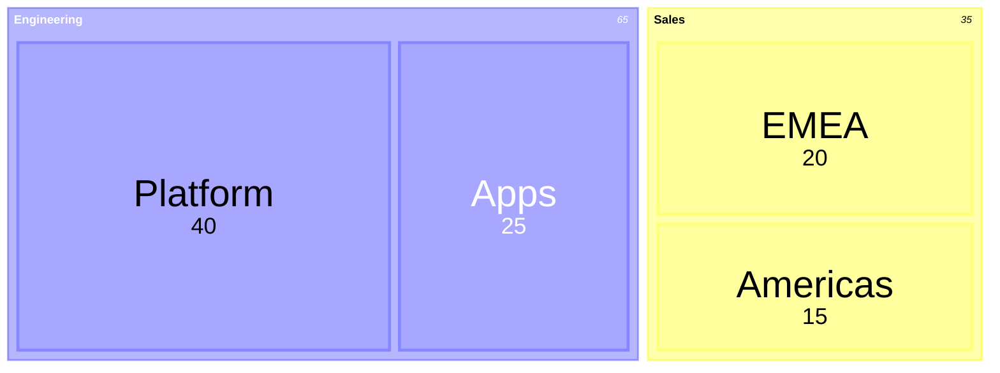

# Treemap

## When to use

- A hierarchy (two or more levels) with a size per leaf, where the whole matters and the leaf count is large: budget lines by department, disk usage by folder, market cap by sector and company.
- Sizes are skewed: a few large parts and a long tail; the treemap shows the dominance and keeps the tail visible as small tiles.
- A second measure as colour (change, margin) on top of size: sector maps of stock returns.
- Space is tight and dozens to hundreds of leaves must fit in one view.
- Excels at: "what dominates" at two levels in a single rectangle, with room for labels on the big tiles.

## When not to use

- Flat data with a handful of categories: a sorted `bar` reads the sizes far more accurately (Heer and Bostock 2010).
- Small differences between tiles: rectangular area is a weak encoding; readers cannot tell 12% from 14%.
- Deep hierarchies (four or more levels) or when the path to a leaf matters: nesting borders swallow the space; use `icicle` or `sunburst`.
- Negative values or a measure that does not sum meaningfully (rates, averages): tiles must be additive.
- Comparing two treemaps (two years): layout changes with the data, so nothing lines up; use a `slope`, `dumbbell` or `stacked-bar`.

## Substitutes

- Few parts, one level: `bar` or `pie`; several wholes: `stacked-bar-100`.
- Depth and paths: `icicle` (rectangular, labels fit) or `sunburst` (radial); structure without sizes: `tree`.
- Nested but circular, for aesthetics: `circle-packing` (less accurate).
- Two categorical dimensions with meaningful widths: `marimekko`.
- Exact values: `table` sorted with inline bars.

## Evidence

- Rectangular area is read less accurately than length or position (Heer and Bostock 2010 added it to the Cleveland and McGill 1984 tasks); the treemap's justification is scale and hierarchy, not precision. `medium`: replicated evidence about the encoding, consistent guidance about when hierarchy earns it (Shneiderman 1991 origin; FT caveat about many tiny segments).
- Squarified layout (Bruls, Huizing and van Wijk 2000) keeps aspect ratios near 1, which helps area comparison; prefer it to slice-and-dice.
- Franconeri et al. 2021: colour on top of area is read as pattern, not value; a colour legend and tile labels are mandatory.

## Accessibility

- Label tiles with name and value where they fit; hide labels on tiles too small and expose them in a tooltip or a table.
- Colour for the parent group (categorical, colour-blind-safe, at most 8) or for a second measure (one sequential or diverging ramp), never both.
- Text alternative: "Treemap of <measure> by <level 1> and <level 2>: <A> is the largest group at <share>, led by <leaf>; the smallest is <B>." Provide the hierarchy as an indented table.
- Tile borders with 3:1 contrast against fills so neighbours are separable.

## Build

### mermaid

Hand-written; `treemap-beta` needs Mermaid 12.0 (GitHub and Obsidian were on 11.x as of 2026-09), so use it only when the host version is known, and no negative values. Otherwise render an image with plotly or matplotlib and link it.

### vega-lite

Vega-Lite has no treemap; full Vega does (`treemap` transform on a `stratify` tree, `rect` marks), and vl-convert renders Vega too. Hand-written from the Vega treemap example: `"transform": [{"type": "stratify", "key": "id", "parentKey": "parent"}, {"type": "treemap", "field": "size", "method": "squarify", "size": [{"signal": "width"}, {"signal": "height"}]}]` then `rect` on `x0/x1/y0/y1`. `approx` because it leaves Vega-Lite.

### plotly

`{"type": "treemap", "labels": ["All", "Engineering", "Platform", "Apps"], "parents": ["", "All", "Engineering", "Engineering"], "values": [0, 65, 40, 25], "branchvalues": "remainder", "textinfo": "label+value+percent parent"}`; `branchvalues: "total"` when parent values already include children. Hand-written, then `cw.py render --target plotly --in fig.json --out chart.html`.

### chartjs

Hand-written with the community `chartjs-chart-treemap` plugin: `{"type": "treemap", "data": {"datasets": [{"tree": rows, "key": "value", "groups": ["dept", "team"], "labels": {"display": true}}]}}`. `approx`, plugin quality varies.

### matplotlib

Hand-written: `pip install squarify` then `squarify.plot(sizes=values, label=names, alpha=0.9, pad=True); plt.axis("off")` for one level; nest by computing `squarify.squarify` rectangles per group and drawing `matplotlib.patches.Rectangle`. Render with `cw.py render --target matplotlib --in chart.py --out chart.png`.

### echarts

Hand-written: series type `treemap` with nested `children`. See `kb/targets/echarts.md`.

### quickchart

Approximate: QuickChart `treemap` plugin type; write the Chart.js config by hand and URL-encode it (see `kb/targets/quickchart.md`).

## Notes

- 2026-09-17: written from the 2026-09-17 taxonomy research.
