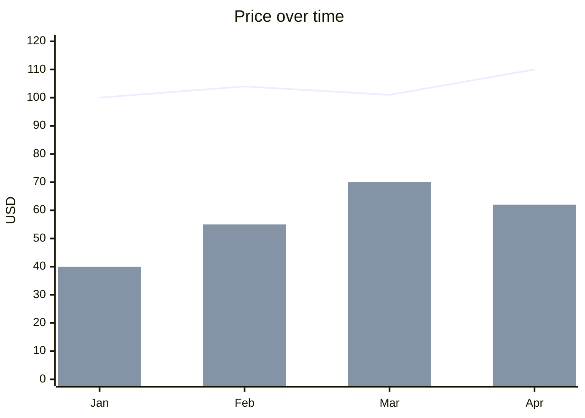

# Markdown (Mermaid)

The only chart syntax that renders inside a plain markdown file on GitHub, GitLab, Obsidian, Notion and most doc sites. Use it when the chart must live in the text and the type is one Mermaid draws; otherwise render an image (vega-lite target) and link it.

## What it can draw

| chart | support | note |
|---|---|---|
| line, multi-line, step | native | `xychart` line series; step is approximated by a line |
| bar / column | native | `xychart` bar; several bar series overlap rather than group (issue #5292), so grouped bars are `approx` at best |
| area, stacked-bar, scatter, histogram, boxplot, heatmap, bubble, dumbbell | none | not in Mermaid; use an image |
| pie | native | `pie showData`; no donut hole, no custom order beyond input order |
| donut | approx | rendered as a pie |
| sankey, alluvial | native | `sankey-beta`, CSV rows `source,target,value`; still marked experimental |
| radar | native | `radar-beta` since 11.6 |
| quadrant | native | `quadrantChart`, points normalised to 0..1 |
| treemap | native (12.0) | `treemap-beta`; not on hosts below 12 |
| gantt, timeline, gitgraph, mindmap, kanban | native | diagram types, stable in 11.x |
| venn, wardley, use case, agentflow | native (12.0 only) | too new for GitHub/Obsidian as of 2026-09 |

## Syntax essentials

- `xychart` (11.16+; `xychart-beta` still accepted and is what `cw.py build` emits for the widest host support). Named series (`line "2026" [...]`) give a legend on 11.16+; unnamed series have no legend, so state the series order in a comment or caption.
- x-axis: category list `[a, b]` or numeric range `0 --> 10`; y-axis numeric only, optional range. `xychart horizontal` flips it.
- Point labels since 11.16: `line [1.5 "label", 2.3]`.
- `pie showData` prints values; `"Label" : value` per slice.
- `sankey-beta` takes raw CSV lines, no indentation, quote labels containing commas.
- `radar-beta`: `axis a[Label], b[Label]` then `curve name[Label]{v1, v2}`; optional `max 100`.
- `quadrantChart`: `x-axis Low --> High`, `quadrant-1 Text`, points `Name: [0.3, 0.6]`.
- Theme and size: a leading `%%{init: {"theme": "neutral"}}%%` directive; `config: xyChart: width/height` in a frontmatter block on 11.x.

## Limits

- No scatter, histogram, box plot, heatmap, area, stacked or grouped bars, dual axis, log scale, error bars, per-point colour.
- Host version lag: GitHub ran 11.16.1 in 2026-08, Obsidian 11.13, GitLab 11 since 19.0 (2026-05), Azure DevOps a limited subset. Anything marked 12.0 or `-beta` newer than 11.13 may not render for the reader. When the host is unknown, stay on the 11.13 floor: xychart(-beta), pie, quadrant, sankey-beta, radar-beta, timeline, gantt, gitGraph, mindmap, kanban, packet, block, architecture.
- Confluence has no native Mermaid (marketplace apps only). Word and Google Docs never render it: use an image.
- Long category lists overflow: keep x categories under about 12 or switch to an image.

## Render

- In place: the host renders the fenced block. Nothing to run.
- To an image: `python scripts/cw.py render --target mermaid --in chart.md --out chart.svg` (uses `mmdc` if installed, else `npx @mermaid-js/mermaid-cli`, which needs Node 22.12+ and downloads a headless Chromium on first run). Or paste into https://mermaid.live and export. Kroki (`https://kroki.io/mermaid/svg/<deflate+base64url>`) renders without a local install.
- `mermaid.parse()` in Node validates syntax before publishing; the CLI does the same implicitly.

## Notes

- 2026-09-17: created from the 2026-09-17 library research (Mermaid 12.0.0 released 2026-09-10 with ELK default, treemap, venn, use case, agentflow). `cw.py build --target mermaid` emits `xychart-beta` and unnamed series for maximum host compatibility; hand-add series names when the host is 11.16+.
